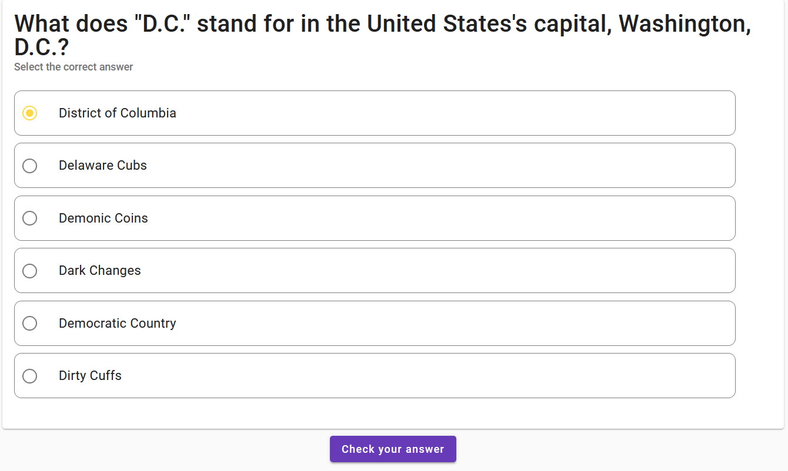
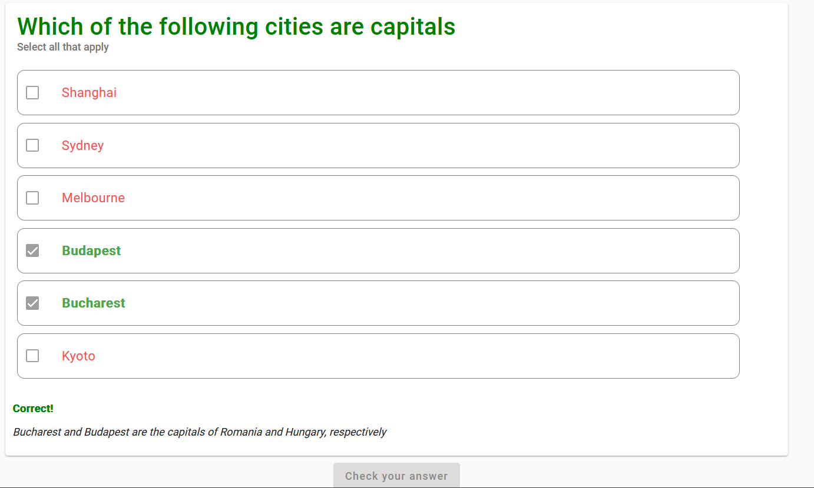
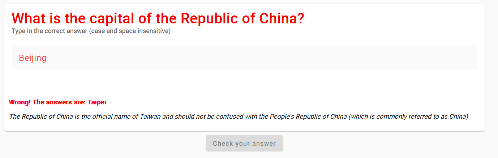
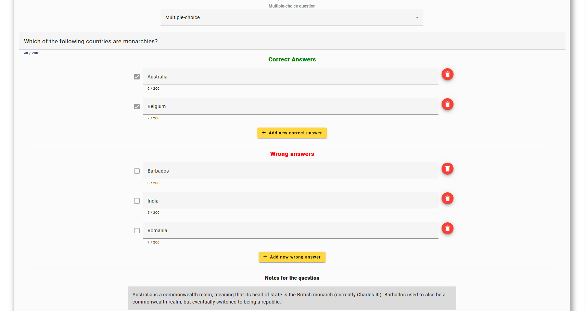
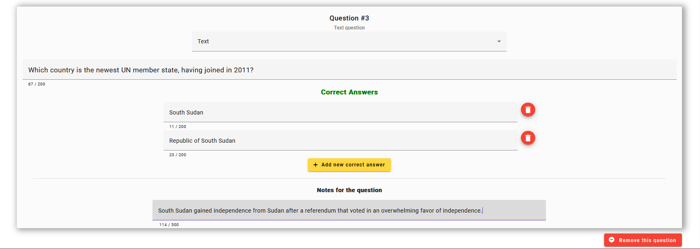

# QuizWorld
Quiz World is an application that allows you to play on and create quizzes.

## Preview images

<details>
<summary>Toggle images</summary>
<br>







</details>

## How to run
```bash
npm install
npm run start
```

## Running tests
```bash
npm run test # launches Chrome
npm run test:headless # runs in headless mode, does not run in watch mode
npm run test:headless:watch # runs in headless and watch mode

npm run test:e2e # runs Playwright tests in headless mode
npm run test:e2e:debug # runs Playwright tests in debug mode, useful for close inspection of specific tests
```

## Structure

### app
- ``constants`` - holds files that contain constant values, e.g. API endpoints, available roles, etc.
- ``core`` - holds important services, shell components like header, footer, and etc., and other elements that need to be imported within the ``AppModule`` and loaded alongside the app.
- ``shared`` - holds reusable components, pipes, guards, directives, and other elements that can be used across multipe modules. You can import the shared module in any module where you need the components, pipes, or directives.
- ``features`` - holds components and services that implement a specific feature of the app, such as a form page, search bar, etc.
- ``routing`` - configures the app's routing modules. Contains interceptors, resolvers, and guards.
- ``store`` - configures the ngrx store.
- ``util`` - holds features that do not fit in any of the above.

Each folder and its respective subfolders contain more documentation for the different components, services, etc.

### environments
Contains environment variables for development and production modes.

The app assumes that the .NET server associated with it runs on localhost:5000 in development stage. If you want to change this, navigate to ``src/environments`` and change whatever configuration you need to change. The server also offers an HTTPS connection on port 7246 (if you configure an SSL certificate).

### types
Contains custom types.

## License
MIT