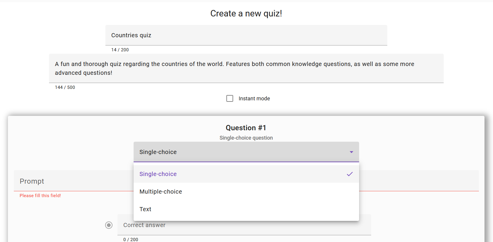
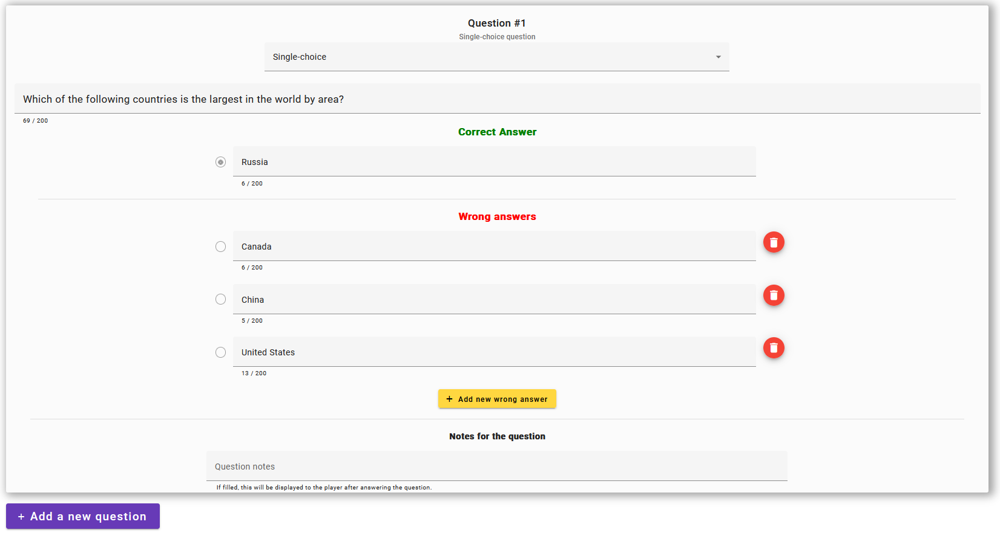

# Quiz World - a web app for creating and playing quizzes
This repository contains the client of the app, written in Angular 19.

## Preview images

<details>
<summary>Toggle images</summary>
<br>




</details>

## Installing
```bash
npm i --force
```
This is a temporary measure, as one of the dependencies (``@ngrx/signals``) has a peer dependency with Angular 19, rather than Angular 20. The app itself is
functional and the issue will be addressed once ngrx updates.

## How to run
```bash
ng serve
```
The client app runs on ``http://localhost:4200``

Check out [the server documentation](https://github.com/RyotaMitaraiWeb/QuizWorld) to run the backend associated with the app.

## Tests
```bash
ng test
```
This will launch Karma in the browser

## Project architecture
The ``app`` folder is structured the following way:

- ``common`` - contains constant values, validation rules, and other magic values
- ``components`` - contains components split by areas of the app. The ``common`` subfolder includes components used in multiple parts of the app
- ``directives`` - contains directives used in parts of or the whole app
- ``interceptors`` - contains interceptors
- ``pages`` - contains components that are rendered and included in the ``app.routes.ts`` file
- ``pipes`` - contains custom pipes
- ``services`` - contains services which can be injected in all parts of the app. The ``shared`` subfolder features services that are used to avoid prop drilling.
- ``store`` - features ``SignalStore`` services to share state across the app
- ``types`` - features global types used in multiple parts of the app
- ``util`` - contains utility functions to solve specific technical problems
- ``validators`` - contains custom validators to be combined with Angular forms.

## Admin area
An admin area to manage user roles, as well as review activity logs, can be accessed
at ``/admin`` if your user has the "Administrator" role.